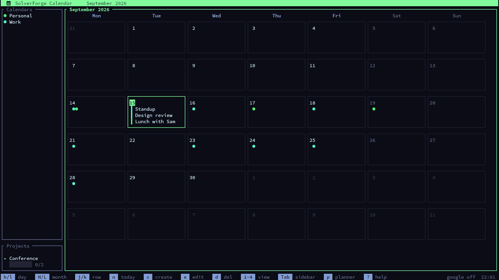

# SolverForge Calendar

<div align="center">

  

  <br />

  [](https://github.com/blackopsrepl/solverforge-calendar/actions/workflows/ci.yml)
  [](https://github.com/blackopsrepl/solverforge-calendar)
  [](https://www.rust-lang.org)
  [](https://ratatui.rs/)

</div>

A ratatui desktop calendar with local SQLite storage, a JSON-first automation CLI, real `.ics` import/export, and conflict-aware Google Calendar sync.



## Quick Start

```bash
# Build both binaries
cargo build --release
./target/release/solverforge-calendar

# Human-facing TUI entrypoint
cargo run

# Agent-facing CLI entrypoint
cargo run --bin solverforge-calendar-cli -- calendars list

# Stable wrapper for automation
./scripts/solverforge-calendar-cli calendars list
```

## Features

- Multiple views: month, week, day, and agenda with vim-style navigation
- Google Calendar: desktop OAuth via system browser, discovery/import, read-only vs writable calendars, explicit sync status, and two-way sync for supported event fields
- Safe sync: outbound queue, incremental pull sync, ETag-based conflict detection, and CLI conflict resolution
- Shared event service: TUI, CLI, `.ics` import, and Google sync all route through the same validation and timezone logic
- Timezone-correct events: local wall-clock timestamps round-trip through a shared IANA timezone layer
- `.ics` import/export: VEVENT import with warnings for unsupported shapes plus export for local data exchange
- Event dependencies: DAG-linked events with cycle detection and topological ordering
- Non-blocking I/O: background workers for DB and Google operations in the TUI
- Local SQLite database: events, calendars, projects stored in `~/.local/share/solverforge/calendar.db`
- Desktop notifications: reminder alerts via libnotify

## Keybindings

### Global

- `Ctrl+c` / `q`: quit
- `1` / `2` / `3` / `4`: month / week / day / agenda
- `?`: help
- `G`: Google management
- `S`: sync Google calendars now
- `i`: open `.ics` import
- `x`: export visible events to `~/solverforge-calendar.ics`

### Navigation

- `h` / `j` / `k` / `l`: move
- `H` / `L`: previous / next month in month view
- `Tab`: focus sidebar
- `Space`: toggle calendar visibility in the sidebar
- `n`: jump to today / now

### Events

- `c`: create event
- `e`: edit selected event
- `d`: delete selected event
- `Enter`: open or select
- `/`: quick-add event title into the focused date

### Google Management

- `r`: refresh discoverable calendars
- `i` / `Enter`: import the selected discoverable Google calendar
- `l`: login or reconnect
- `o`: logout
- `s`: sync now

## CLI Automation

`solverforge-calendar-cli` is the non-interactive automation contract. Successful commands write JSON to stdout, failures write JSON to stderr, and there are no prompts or interactive confirmations.

```bash
# Calendars
cargo run --bin solverforge-calendar-cli -- calendars list
cargo run --bin solverforge-calendar-cli -- calendars create --name Work --color '#50f872'

# Events
cargo run --bin solverforge-calendar-cli -- events create \
  --calendar-id <calendar-id> \
  --title 'Planning Session' \
  --start-at '2026-03-30 15:00:00' \
  --end-at '2026-03-30 16:00:00'

# Google auth and discovery
cargo run --bin solverforge-calendar-cli -- google auth status
cargo run --bin solverforge-calendar-cli -- google auth login --client-id <desktop-client-id>
cargo run --bin solverforge-calendar-cli -- google calendars discover
cargo run --bin solverforge-calendar-cli -- google calendars import --google-id primary@example.com

# Explicit sync status and conflict handling
cargo run --bin solverforge-calendar-cli -- google sync
cargo run --bin solverforge-calendar-cli -- google sync-status
cargo run --bin solverforge-calendar-cli -- google conflicts list
cargo run --bin solverforge-calendar-cli -- google conflicts resolve <conflict-id> --strategy keep-local

# iCal import
cargo run --bin solverforge-calendar-cli -- ical import \
  --calendar-id <calendar-id> \
  --path ./sample.ics
```

Available groups:

- `calendars`: `list`, `get`, `create`, `update`, `delete`
- `projects`: `list`, `get`, `create`, `update`, `delete`
- `events`: `list`, `get`, `create`, `update`, `delete`
- `dependencies`: `list`, `get`, `create`, `update`, `delete`
- `google auth`: `status`, `login`, `logout`
- `google calendars`: `discover`, `import`
- `google`: `sync`, `sync-status`, `conflicts list`, `conflicts resolve`
- `ical`: `import`

## Google Calendar Setup

1. Create Google OAuth credentials of type `Desktop app`.
2. Enable the Google Calendar API for that project.
3. In the TUI press `G`, or run `google auth login` in the CLI.
4. SolverForge opens the system browser, uses a random loopback callback port, validates `state`, and uses PKCE `S256`.
5. The refresh token is stored in the OS keyring under the `solverforge-calendar` service.

Current Google behavior:

- OAuth uses the full `https://www.googleapis.com/auth/calendar` scope so one credential set can cover discovery plus writable event sync safely.
- Outbound Google writes use `sendUpdates=all`.
- Read-only Google calendars can be imported but reject local edits.
- Supported two-way sync scope: single events, all-day events, title, description, location, start/end, and recurring master RRULE values.
- Detached recurring exceptions, attendee editing, attachments, and conference-data creation are not supported yet.
- Auto-sync is explicit only. The app does not sync automatically on startup.

## `.ics` Import Scope

`.ics` import now works in both the CLI and the TUI.

- Imported fields: title, description, location, start/end, all-day flag, and RRULE
- Floating timestamps default to the local system timezone unless a `TZID` is present
- Unsupported shapes are reported as warnings instead of being silently ignored
- Recurrence exceptions such as `RECURRENCE-ID`, `RDATE`, and `EXDATE` are skipped for now

## Developer Workflow

```bash
make build
make run
make run-cli ARGS="events list"
make lint
make test
make ci-local
make pre-release
```

Contributor and automation guidance lives in [AGENT.md](AGENT.md). Product scope and implementation references live in [PRD.md](PRD.md). UI and CLI structure references live in [docs/wireframes/tui.md](docs/wireframes/tui.md) and [docs/wireframes/cli.md](docs/wireframes/cli.md).

## Architecture

- `src/app.rs`: TUI state machine and worker result handling
- `src/event_service.rs`: shared event validation, timezone normalization, and Google outbox enqueue rules
- `src/calendar_service.rs`: shared calendar validation and Google import rules
- `src/ical.rs`: `.ics` import/export
- `src/google/auth.rs`: desktop OAuth, keyring storage, and token refresh
- `src/google/discovery.rs`: Google calendar discovery
- `src/google/events_api.rs`: typed Google Calendar event HTTP adapter
- `src/google/types.rs`: Google payload mapping and event body generation
- `src/sync/engine.rs`: sync orchestration and status reporting
- `src/sync/pull.rs`: incremental inbound sync with `syncToken` recovery
- `src/sync/push.rs`: outbound create / patch / delete and ETag handling
- `src/sync/conflicts.rs`: conflict listing and resolution
- `src/sync/state.rs`: outbox, sync-state, and conflict persistence helpers
- `tests/cli.rs`: binary-level CLI integration coverage

## Development

```bash
cargo build           # debug
cargo build --release # optimized
cargo build --bins    # both binaries
cargo check           # fast type check
cargo clippy          # lint
cargo test            # run tests
make ci-local         # local CI simulation
make pre-release      # release-oriented validation
```
