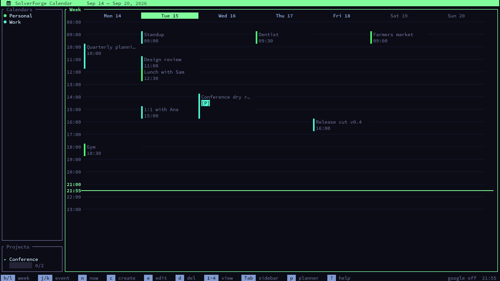
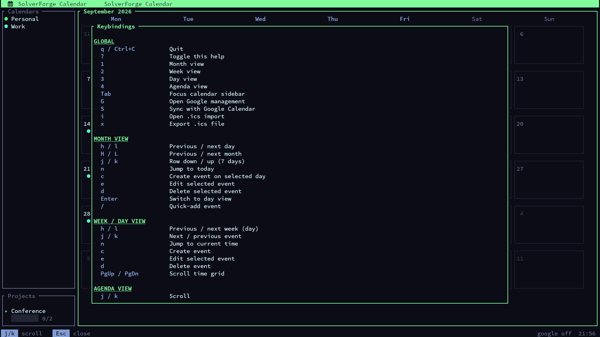
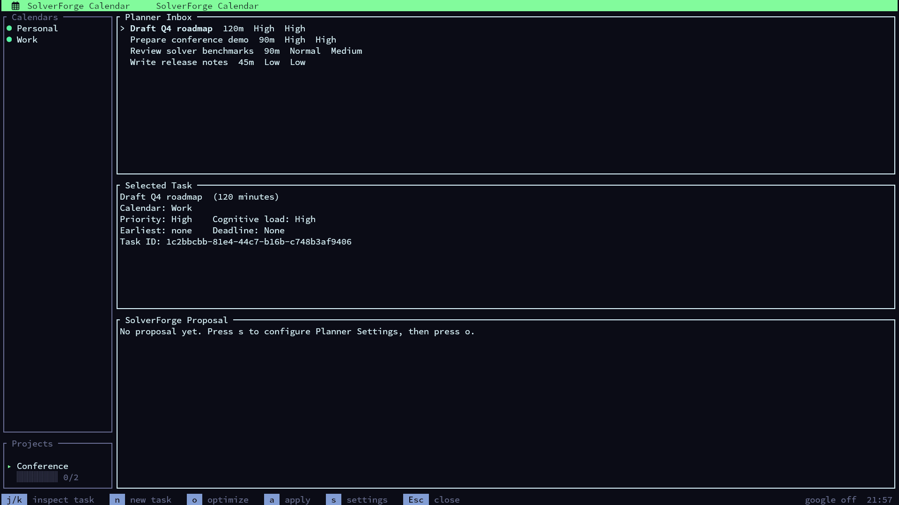
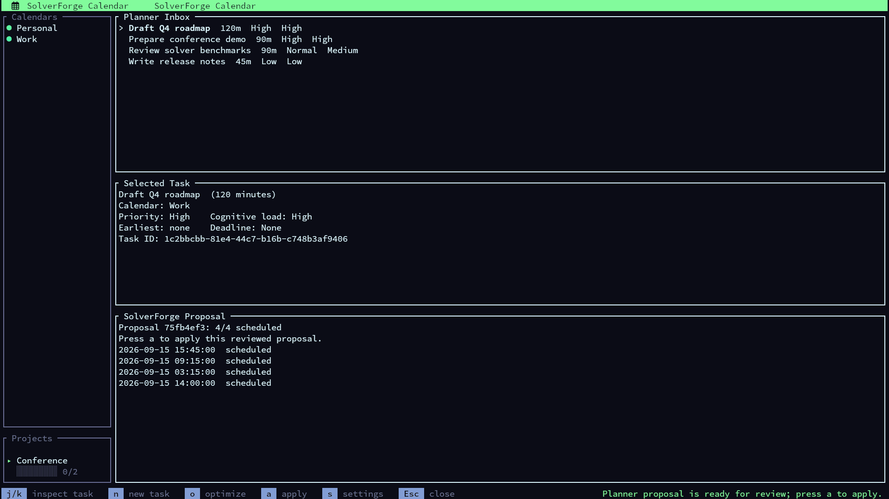

# Planner123

<div align="center">

  

  <br />

  [](https://github.com/blackopsrepl/Planner123/actions/workflows/ci.yml)
  [](https://github.com/blackopsrepl/Planner123)
  [](https://www.rust-lang.org)
  [](https://ratatui.rs/)

</div>

Planner123 is a keyboard-driven calendar that runs entirely on your
machine. Your events live in a local SQLite database — not in someone's cloud —
while optional two-way Google Calendar sync and `.ics` import/export keep you
connected to everyone else.

The part that makes it different is the built-in **AI planner**: instead of just
storing your calendar, it can actually schedule your to-do list for you. You
tell it what needs doing and when you are available; it proposes concrete time
slots that respect your meetings, deadlines, and the hours in which you do your
best thinking. Nothing ever lands on your calendar until you review the
proposal and say yes.


## Quick Start

```bash
cargo build --release
./target/release/planner123
```

That's it — the app creates its database on first launch at
`~/.local/share/planner123/calendar.db` and starts with a fresh calendar.
Press `?` inside the app for the keybinding cheat sheet, or `p` to meet the
planner.

If you prefer not to build from source, every feature is also reachable
through a non-interactive CLI (see [Automating and scripting](#automating-and-scripting)).

## Your calendar, day to day

### Views

Press `1`–`4` to switch views:

- **Month** — the overview. The selected day shows its events; other days show dots.
- **Week** and **Day** — a time grid with a "now" line, event selection, and scrolling.
- **Agenda** — a simple upcoming list.



### Working with events

- `c` creates an event on the selected day (title, time, calendar, location,
  description, repeat rule, reminder, project).
- `/` quick-adds an event by title into the focused date — the fastest way to
  capture something.
- `e` edits and `d` deletes the selected event; `Enter` drills into a day.
- Events can repeat (weekly, and more via RRULE), can be all-day, can carry a
  reminder that fires as a desktop notification, and can belong to a project.
- Calendars are color-coded and can be toggled on/off in the sidebar with
  `Tab` + `Space`, so you can focus on work, personal, or anything else.

Press `?` any time for the built-in cheat sheet:



### Everything stays consistent

The TUI, the CLI, `.ics` import, and Google sync all route event changes
through one shared validation and timezone layer. A time is a wall-clock time
in your timezone — the same event reads the same whether you created it in the
TUI, imported it from an `.ics` file, or pulled it from Google.

## AI planning: the Planner Inbox

Most calendars only remember what you already scheduled. The Planner Inbox is
for the other kind of work: the things you know you need to do, but that don't
have a time yet.

You add tasks ("Draft Q4 roadmap, about two hours, needs my best focus,
deadline Friday"), and the built-in constraint solver figures out *when* they
should happen. It works like a scheduling assistant that reads your real
calendar and hands you a plan — which you approve before anything changes.



### The workflow

1. **Add tasks** — press `p` to open the inbox, then `n`. Give each task a
   duration, a priority (`low` / `normal` / `high`), and optionally a cognitive
   load (`low` / `medium` / `high`), an earliest start, and a deadline.
2. **Tell it your week** — press `s` to set your timezone, your working hours
   (e.g. `mon=09:00-17:00`, split shifts allowed), and — if you want — the
   windows in which you do your best deep work.
3. **Optimize** — press `o`. The solver runs for a few seconds and produces a
   proposal: concrete slots for every task it could place.
4. **Review** — read the proposal. Check the times. Nothing has happened yet.
5. **Apply** — press `a` (or `planner proposals apply` in the CLI). Only now
   do the tasks become real events on your calendar.



### What the planner respects

- **Your existing events are busy time.** Every active calendar counts — the
  planner will never double-book you.
- **Availability windows always win.** Work only lands inside the hours you
  declared, in your timezone.
- **Deadlines matter.** Hard deadlines are honored; soft-deadline lateness
  outranks every deep-work preference. Priorities decide who gets the scarce
  slots.
- **Deep work is a preference, not a tyranny.** High-cognitive-load tasks are
  steered toward your focus windows and separated by recovery breaks. Back to
  back high-load tasks cost you, and previously applied high-load blocks count
  toward your configured streak limit before a task is charged. These
  preferences bend; your availability and deadlines never do.

### You stay in control

- **Proposals change nothing.** Until you apply, your calendar is untouched.
  A stale proposal (inbox changed since optimizing) is refused — re-optimize
  and review the fresh one.
- **Applied tasks are pinned.** If a scheduled task turns out to be wrong,
  `return-to-inbox` removes exactly that task's event — nothing else.
- **Sync stays explicit.** If you use Google calendars, the planner requires
  one successful sync first (so it plans around reality), and applying a
  proposal never auto-syncs. You always pull the trigger.

The same workflow exists in the CLI — see the
[planner commands](#automating-and-scripting) — which is also how agents drive
the planner for you.

## Google Calendar sync

Planner123 can work alongside your existing Google Calendars with
conflict-aware two-way sync.

Setup, once:

1. Create Google OAuth credentials of type `Desktop app` and enable the
   Google Calendar API for that project.
2. In the TUI press `G` (or run `google auth login` in the CLI).
3. Your system browser opens; Planner123 validates the OAuth round trip
   (PKCE `S256`, random loopback port) and stores the refresh token in your OS
   keyring — never in a config file.
4. Discover and import the calendars you want. Read-only Google calendars can
   be imported but reject local edits.

Behavior you can rely on:

- **Sync only happens when you ask.** Press `S` (or `google sync`) — the app
  never syncs on startup or in the background on its own.
- **Conflicts are detected, not overwritten.** ETag-based conflict detection
  means concurrent edits surface as explicit conflicts you resolve in the CLI
  (`keep-local` or `keep-remote`), and outbound changes travel through a queue
  you can inspect.
- **What syncs:** single events, all-day events, title, description, location,
  start/end, and recurring master RRULE values. Detached recurrence
  exceptions, attendee editing, attachments, and conference-data creation are
  not supported yet.

## `.ics` import and export

Moving from another calendar? Press `i` (or `ical import` in the CLI) to
import `.ics` files: title, description, location, start/end, all-day flags,
and RRULE recurrence come across; anything unsupported is reported as a
warning instead of being silently dropped. Floating timestamps default to your
local timezone unless the file specifies `TZID`.

Press `x` to export everything currently visible to `~/planner123.ics`.

## Automating and scripting

Every feature is exposed through `planner123-cli`, a
non-interactive CLI that speaks JSON on stdout (success) and stderr (failure)
with no prompts. It is the stable contract used by scripts, cron jobs, and AI
agents.

```bash
# Calendars
cargo run --bin planner123-cli -- calendars list
cargo run --bin planner123-cli -- calendars create --name Work --color '#50f872'

# Events
cargo run --bin planner123-cli -- events create \
  --calendar-id <calendar-id> \
  --title 'Planning Session' \
  --start-at '2026-03-30 15:00:00' \
  --end-at '2026-03-30 16:00:00'

# Google auth and discovery
cargo run --bin planner123-cli -- google auth status
cargo run --bin planner123-cli -- google auth login --client-id <desktop-client-id>
cargo run --bin planner123-cli -- google calendars discover
cargo run --bin planner123-cli -- google calendars import --google-id primary@example.com

# Explicit sync status and conflict handling
cargo run --bin planner123-cli -- google sync
cargo run --bin planner123-cli -- google sync-status
cargo run --bin planner123-cli -- google conflicts list
cargo run --bin planner123-cli -- google conflicts resolve <conflict-id> --strategy keep-local

# iCal import
cargo run --bin planner123-cli -- ical import \
  --calendar-id <calendar-id> \
  --path ./sample.ics

# Planner: configure, add tasks, optimize, review, apply
cargo run --bin planner123-cli -- planner settings update \
  --timezone Europe/Rome \
  --availability mon=09:00-17:00 \
  --cognitive-enabled true --high-window-start 08:00 --high-window-end 12:00 \
  --high-outside-penalty 1 --high-streak-limit 1 --recovery-minutes 30
cargo run --bin planner123-cli -- tasks create \
  --title 'Design review' --duration-minutes 60 --target-calendar-id <calendar-id> \
  --priority high --cognitive-load high
cargo run --bin planner123-cli -- planner optimize
cargo run --bin planner123-cli -- planner proposals list
cargo run --bin planner123-cli -- planner proposals apply <proposal-id>
```

Command groups:

- `calendars`: `list`, `get`, `create`, `update`, `delete`
- `projects`: `list`, `get`, `create`, `update`, `delete`
- `events`: `list`, `get`, `create`, `update`, `delete`
- `dependencies`: `list`, `get`, `create`, `update`, `delete`
- `google auth`: `status`, `login`, `logout`
- `google calendars`: `discover`, `import`
- `google`: `sync`, `sync-status`, `conflicts list`, `conflicts resolve`
- `ical`: `import`
- `tasks`: `list`, `get`, `create`, `update`, `delete`, `return-to-inbox`, `dependencies`
- `planner settings`: `show`, `update`
- `planner`: `optimize`, `proposals list`, `proposals get`, `proposals apply`

A stable wrapper for automation lives at `./scripts/planner123-cli`.

### Agent skill

A portable [Agent Skill](skills/planner123/SKILL.md) teaches any
agent the full JSON contract, data isolation, planner workflow, and repo
maintenance rules. The repo also ships `.agents/skills/planner123`
pointing at it, so Codex picks the skill up automatically when working inside
this repository. For user-scope installs (symlinks that stay in sync with this
checkout):

```bash
./scripts/install-skill                 # opencode + Codex (~/.agents/skills)
./scripts/install-skill --only codex    # just Codex user scope
./scripts/install-skill --only opencode # just opencode
./scripts/install-skill --copy          # copy instead of symlink
./scripts/install-skill --list          # show install state
./scripts/install-skill --uninstall     # remove
```

Restart the agent after installing so it rescans skills.

## Contributing

```bash
make build
make run
make run-cli ARGS="events list"
make lint
make test
make ci-local
make pre-release
```

Or straight cargo:

```bash
cargo build           # debug
cargo build --release # optimized
cargo build --bins    # both binaries
cargo check           # fast type check
cargo clippy          # lint
cargo test            # run tests
```

Contributor and automation guidance lives in [AGENT.md](AGENT.md). Product
scope and implementation references live in [PRD.md](PRD.md). UI and CLI
structure references live in [docs/wireframes/tui.md](docs/wireframes/tui.md)
and [docs/wireframes/cli.md](docs/wireframes/cli.md).

### Architecture map

For contributors navigating the code: `src/app.rs` + `src/app/` is the TUI
facade, `src/cli.rs` + `src/cli/` the CLI facade, and `src/event_service.rs`,
`src/calendar_service.rs`, `src/ical.rs`, `src/google/`, `src/sync/`,
`src/db.rs`, `src/planner.rs`, and `src/models.rs` hold the shared services
behind them, each split into focused submodules. `tests/cli.rs` +
`tests/cli/` covers the CLI at the binary level. Every tracked Rust source and
test file stays below 300 lines; public root module paths remain stable.
